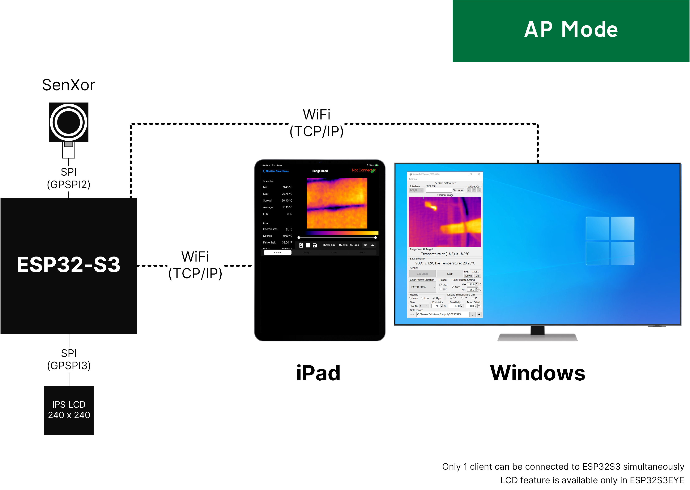
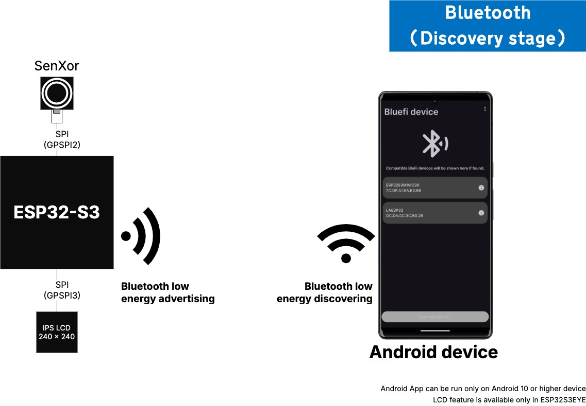
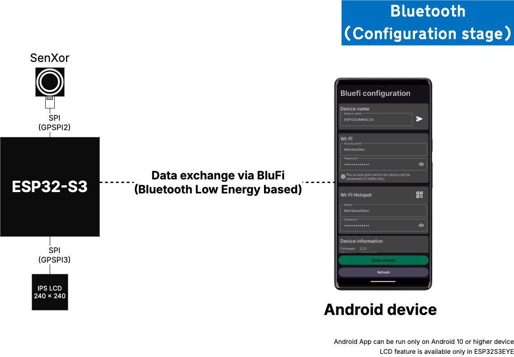
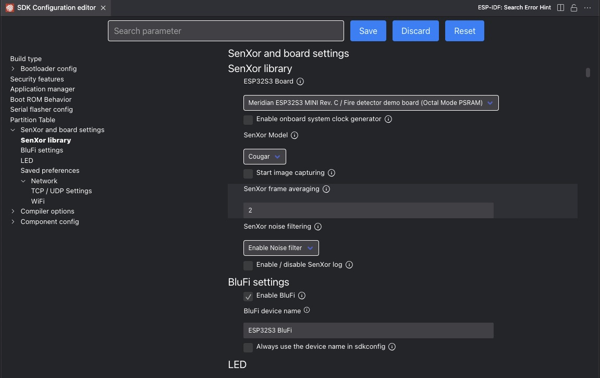
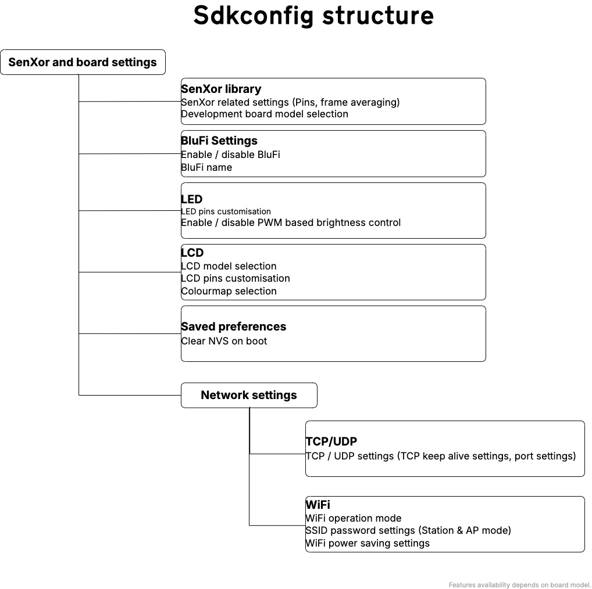
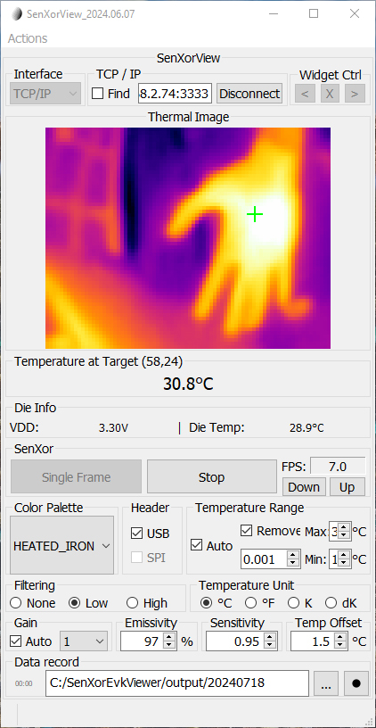
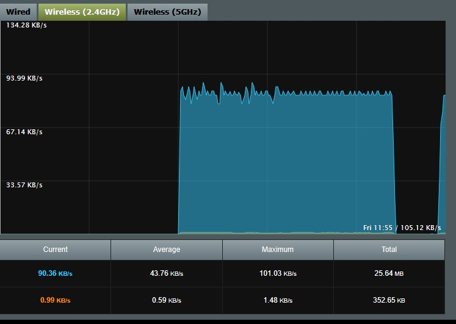

# senxorESP32S3

This project contains the source of the firmware for ESP32S3, which enables ESP32S3 interfacing with  **Mini Cougar** SenXor and deliver the processed thermal data to client via TCP/IP. 
It also supports WiFi SSID configuration via WiFi (Direct connection to ESP32) and Bluetooth (via Espressif BluFi protocol).

## Features

**1.** Control SenXor and display thermal image via WiFi (Either through an access point or direct connection to ESP32)

**2.** Configure ESP32S3's WiFi remotely via WiFi direct connection to ESP32 or Bluetooth (beta)

**3.** Support the saving of user preferences to FLASH. The preferences will be loaded on ESP32 bootup.

**4.** Features customisation via sdkconfig.

**5.** Included an optimal default configration in project which minimise project configuration time.

## WiFi operation modes
By default, the ESP32S3's WiFi is operated under AP and station mode. 

In **AP mode (access point mode)**, ESP32S3 acts as an access point allowing device to connect. 

In **station mode**, ESP32S3 will connect to an access point. The IP address of ESP32S3 is assigned by the DHCP server in that access point. 

**AP (Access Point) Mode**

ESP32S3 acts as an access point allowing device to connect. It also act as DHCP server assigning IP address to client.

     

**Station Mode**

ESP32S3 will connect to an access point. The IP address of ESP32S3 is assigned by the DHCP server in that access point. 

     

## Remote configuration

Remote configuration is supported so that user can set the ESP32 without installing ESP-IDF. This is achieved by an Android App using BluFi protocol that based on Bluetooth LE.

**BluFi (Bluetooth)**

In this mode, the app will search for Bluetooth enabled ESP32S3. Configuration can be updated or retrieved upon a successful connection.
There are 2 stages in this mode, discovery stage and configuration mode.

Discovery stage

ESP32S3 advertises and Android searches for ESP32S3 via Bluetooth Low Energy.

     

Configuration stage

Connection is established between ESP32S3 and Android. The data is exchanged via secured Bluetooth.

     

## Requirements

**Hardware**
1. **Mini-Cougar** SenXor
2. ESP32S3
	1. ESP32-S3 EYE        (Adaptor board is required)
	2. ESP32-S3 DevKitC-1  (Adaptor board is required)
	3. ESP32S3 mini
	4. ESP32S3 mini (Rev.C)

	5. Other ESP32S3: 
		1. With at least 2MB PSRAM
		2. With at least 4MB FLASH
		3. With WiFi capability
		4. With Bluetooth low energy capability

	**OTHER ESP32S3 MAY NOT COMPATIBLE WITH THIS FIRMWARE.** 

	**REQUIRES FURTHER DEVELOPMENT BY USERS DUE TO DIFFERENT HARDWARE CONFIGURATIONS.**

Comparison of the compatible development boards

     

**Project building and further development**
1. A Windows 10 / 11 PC:
	- with ESP-IDF 5.2.2
	- with VSCode espressif extension installed
	- with WiFi connection capability
	- with USB capability
2. A USB-A to Micro-USB cable

**Configurating ESP32S3**
1. A compatible ESP32S3 (see hardware part) with this firmware and **Mini-Cougar** SenXor.
2. 	An Android device
	- with ESP32Config App installed
	- with Android 10 or higher
	- with WiFi capability
	- with Bluetooth capability

**Viewing thermal image**
1. A compatible ESP32S3 (see hardware part) with this firmware and **Mini-Cougar** SenXor.

2. An device
	1. A latest version of iOS device
    	- with CESDemo app installed
	2. Windows 10 / 11 PC
		- with WiFi connection capability
		- with SenXorProViewer App

## Customising features (`sdkconfig`)

ESP-IDF provides `sdkconfig` that allows users to configure ESP-IDF components as well as the settings added by firmware developers.

By default, this project comes with `sdkconfig.default` which contains the optimal settings. The settings will be applied during building process.
Under normal circumstances, only (`sdkconfig > SenXor and board config > SenXor libary > ESP32S3 board`) and (`sdkconfig > Component config > ESP PSRAM > SPI RAM Config > Mode (QUAD/OCT) of SPI RAM chip in use `) are required to be configurated. (See 'How to use this program'.) 

To access the settings provided by this firmware, go to `sdkconfig > SenXor and board config`. 

     

The structure of `SenXor and board config` (Applicable for R2.20 or higher):

     

***Features availability depends on the board model.***
***Refers to ESP-IDF programming guide for how to open the sdkconfig***

## How to use this program
1. Ensure the environment meets the requirements
2. Configure ESP32 board model 
	(`sdkconfig > SenXor and board config > SenXor libary > ESP32S3 board`) 
3. Configure PSRAM according to ESP32 board model. 
	The mode of the SPI RAM can be found in the description of settings `ESP32S3 board`. 
	(`sdkconfig > Component config > ESP PSRAM > SPI RAM Config > Mode (QUAD/OCT) of SPI RAM chip in use `) 
4. In case of 4MHz clock is supplied to SenXor, checked "Enable onboard system clock generator".
    (`sdkconfig > SenXor and board config > SenXor libary > Enable onboard system clock generator`) 
	Noted that the program supplied with 2 versions of SenXorLib - Regular version and 4MHz clock version.
	For version R2.23 or higher, when "Enable onboard system clock generator" is checked, SenXorLib 4MHz clock version will be complied automatically.
	***FOR VERSION R2.22 OR LOWER***
	***SET `isUse4MLib TRUE` IN `CMakeLists.txt`UNDER `SenXorLib` TO USE 4MHz clock SenXorLib***

4. Flash the program

## Viewing thermal image
**Using SenXorEVKViewer Windows App**

1. Open SenXor EVK viewer
2. Choose "TCP/IP" under "Interface"
3. Enter the IP address and port number (default: 3333) of the MCU (Depend on Station mode / AP Mode, see 'Finding IP Address of the device' )
4. Click "Connect"

Finding IP Address of the device (**Station mode**)

1. ESP-IDF console output, look for output

	`I (13890) [WiFi]: IP Obtained: xxx.xxx.xxx.xxx`

2. LCD (if supported and enabled)

3. Android config app (Bluetooth only)
	

		 
	

Finding IP Address of the device (**AP mode**)
1. Connect to the ESP32S3
2. Enter the IP address - **192.168.4.1** and port number (default: 3333)
3. Click "Connect"

**Using iOS app**

1. Open CESDemo app
2. Press the gear icon (Located on the app's upper right corner)
3. Enter the ESP32S3's IP address and port (default: 3333) on the "Range Hood" row

## Sample Output
### SenXorEVKViewer streaming thermal image:

     

### Thermal images shown on the iOS App

     

### Bandwidth 
Test environment:
1. Station Mode
2. 802.11n Access point with 2.40GHz and 20MHz bandwidth WiFi connection
3. Distance between ESP32S3 and access point is less than 1 metre
4. Only client, EPS32S3 and a PC (via ethernet cable) are connected to the access point

Typical bandwidth usage is estimated to 90KB/s - 101KB/s, as shown in below figure:

     

## Troubleshooting

1. PSRAM error is displayed on console
	Ensure that PSRAM are configurated** as follow. 
	The configuration can be changed via `sdkconfig`
	*For details, please refer to https://docs.espressif.com/projects/esp-idf/en/latest/esp32s3/api-reference/kconfig.html*

	**Location in sdkconfig:**
	`Component config` > `ESP PSRAM` 
	PSRAM must be configurated as follow:

	| PSRAM Pin  | ESP32-S3-EYE  | ESP32-S3 DevKitC-1  |
	| ------------ | ------------ | ------------ |
	|Accessing Mode   |Octal Mode   |Quad Mode   |

2. Incorrect SSID and password is entered and applied to ESP32
	ESP32 will attempt to connect the the station specified by the user. It will retry until the limit (default: 5) is reached.
	When the limit is reached, the ESP32 will wait for user to set an new station SSID and attempt to connect.
	Because ESP32's WiFi runs under AP + Station mode as well as Bluetooth enabled, user can configure ESP32 remotely via Android App.
	User can also use the Android App to reset ESP32

3. ESP32 is not found in Bluetooth
	Ensure Bluetooth controller and BluFi function are enabled in `sdkconfig`.
	Checked if the Bluetooth in Android device is Bluetooth LE capable.

4. Changing ESP32 Bluetooth's device name
   Please use the Android Configuration App to change the device Bluetooth name.

## REFERENCE
1. ESP-IDF Programming guide

	https://docs.espressif.com/projects/esp-idf/en/latest/esp32s3/index.html
2. ESP32S3 WiFi Driver configuration

	https://docs.espressif.com/projects/esp-idf/en/latest/esp32s3/api-reference/network/esp_wifi.html

3. ESP32S3 Hardware reference (e.g. Datasheet, schematics...)

	https://docs.espressif.com/projects/esp-idf/en/latest/esp32s3/hw-reference/index.html
4. Using VSCode ESP-IDF extension

	https://github.com/espressif/vscode-esp-idf-extension/blob/master/docs/tutorial/install.md

## DISCLAIMER
**FOR DEMOSTRATION PURPOSE ONLY**

**ALL DATA FROM SenXor ARE SOLELY FOR REFERENCE ONLY**

**Revision date** 

18th July 2024